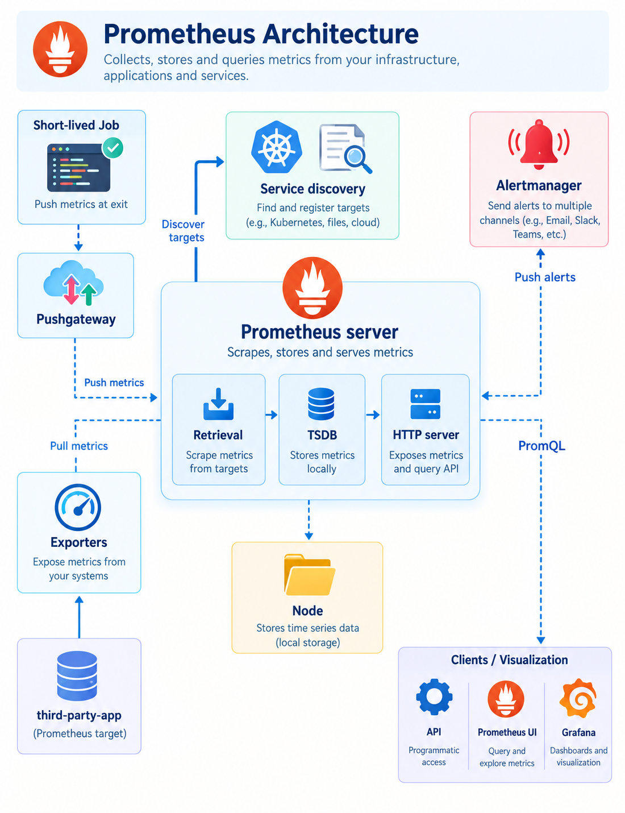

## Prometheus — Setting Up Monitoring

> **File:** `README.md`

> **Primary Platform:** AWS EKS / Kubernetes
>
> **Focus:** Prometheus fundamentals, architecture, kube-prometheus-stack installation, Grafana, Alertmanager, and Kubernetes monitoring
>
> **Level:** Implementation / Practical
>
> **Prerequisite:** Basic Kubernetes, Helm, AWS CLI, `kubectl`, and EKS knowledge

## Table of Contents

1. [Learning Objectives](#1-learning-objectives)
2. [Metrics vs. Monitoring](#2-metrics-vs-monitoring)
3. [What Is Prometheus?](#3-what-is-prometheus)
4. [Prometheus Architecture](#4-prometheus-architecture)
   * [4.1 Prometheus Server](#41-prometheus-server)
   * [4.2 Service Discovery](#42-service-discovery)
   * [4.3 Pushgateway](#43-pushgateway)
   * [4.4 Alertmanager](#44-alertmanager)
   * [4.5 Exporters](#45-exporters)
   * [4.6 Prometheus Web UI](#46-prometheus-web-ui)
   * [4.7 Grafana](#47-grafana)
   * [4.8 API Clients](#48-api-clients)
5. [Prometheus in Kubernetes](#5-prometheus-in-kubernetes)
6. [Lab Architecture](#6-lab-architecture)
7. [Prerequisites](#7-prerequisites)
8. [Step 1 — Create the EKS Cluster](#8-step-1--create-the-eks-cluster)
9. [Step 2 — Install the Prometheus Community Helm Repository](#9-step-2--install-the-prometheus-community-helm-repository)
10. [Step 3 — Create the Monitoring Namespace](#10-step-3--create-the-monitoring-namespace)
11. [Step 4 — Install kube-prometheus-stack](#11-step-4--install-kube-prometheus-stack)
12. [Step 5 — Verify the Installation](#12-step-5--verify-the-installation)
13. [Step 6 — Access the Prometheus UI](#13-step-6--access-the-prometheus-ui)
14. [Step 7 — Access the Grafana UI](#14-step-7--access-the-grafana-ui)
15. [Step 8 — Access the Alertmanager UI](#15-step-8--access-the-alertmanager-ui)
16. [Understanding the Custom Configuration](#16-understanding-the-custom-configuration)
17. [Troubleshooting](#17-troubleshooting)
18. [Cleanup](#18-cleanup)
19. [What We Implemented](#19-what-we-implemented)
20. [Key Takeaways](#20-key-takeaways)

## 1. Learning Objectives

By completing this section, we should be able to:

* Understand the difference between metrics and monitoring.
* Understand the purpose of Prometheus.
* Understand the major components of Prometheus architecture.
* Understand how Prometheus collects and stores metrics.
* Understand Prometheus pull-based metric collection.
* Understand the role of service discovery in Kubernetes.
* Understand the purpose of exporters.
* Understand the purpose of Pushgateway.
* Understand how Alertmanager handles alerts.
* Understand the role of Grafana in a Prometheus-based monitoring stack.
* Create an AWS EKS cluster for the monitoring lab.
* Install the Prometheus Community Helm repository.
* Deploy `kube-prometheus-stack`.
* Verify Prometheus, Grafana, and Alertmanager.
* Access the monitoring components using Kubernetes port forwarding.
* Understand the purpose of the custom Helm values file.
* Troubleshoot common installation and access issues.
* Clean up the EKS cluster and monitoring resources.

## 2. Metrics vs. Monitoring

Before working with Prometheus, we need to understand the difference between **metrics** and **monitoring**.

### 2.1 What Are Metrics?

Metrics are numerical measurements that describe the state or behavior of a system over time.

Examples include:

* CPU utilization
* Memory utilization
* Disk usage
* Network traffic
* Number of HTTP requests
* Request latency
* Error count
* Number of running pods

For example:

```text
CPU Usage       = 72%
Memory Usage    = 65%
Request Rate    = 1,200 requests/sec
Error Rate      = 1.2%
API Latency     = 250 ms
```

These values are **metrics**.

A simple analogy is fitness tracking.

For example:

```text
Steps       = 8,500
Heart Rate  = 72 BPM
Temperature = 30°C
```

These are measurements.

### 2.2 What Is Monitoring?

Monitoring is the process of continuously collecting, evaluating, and observing system measurements to detect abnormal conditions and determine whether a system is operating as expected.

For example:

```text
Metric:

CPU Usage = 95%
```

Monitoring can evaluate that metric against a defined condition:

```text
CPU Usage > 90%
        │
        ▼
     Alert
```

Therefore:

> Metrics are measurements. Monitoring is the process of using measurements to understand system health and detect problems.

#### Simple Mental Model

```text
Metrics
   │
   ▼
Measurements
   │
   ▼
Monitoring
   │
   ├── Observe
   ├── Evaluate
   ├── Detect
   └── Alert
```

Prometheus primarily works with **time-series metrics** and provides capabilities for querying and alerting on those metrics.

## 3. What Is Prometheus?

Prometheus is an open-source monitoring and alerting toolkit designed primarily for collecting, storing, querying, and alerting on time-series metrics.

Prometheus was originally developed at SoundCloud and is now maintained as an open-source project under the Cloud Native Computing Foundation (CNCF).

Prometheus is widely used for monitoring:

* Linux servers
* Applications
* Containers
* Kubernetes clusters
* Databases
* Cloud infrastructure
* Network components
* Custom applications

Some of its important capabilities are:

* Time-series metrics storage
* PromQL query language
* Metric scraping
* Service discovery
* Alerting
* Exporter-based monitoring
* HTTP API
* Integration with visualization tools such as Grafana

### 3.1 Why Prometheus?

Modern infrastructure generates a large amount of operational data.

For example:

```text
Kubernetes Cluster
│
├── Nodes
├── Pods
├── Containers
├── Applications
├── Services
└── Infrastructure
```

Each component can produce metrics.

Prometheus provides a centralized system for collecting and querying those metrics.

A simplified flow is:

```text
Metric Sources
      │
      ▼
Prometheus
      │
      ├── Store metrics
      │
      ├── Query metrics
      │
      └── Evaluate alert rules
      │
      ├───────────────┐
      ▼               ▼
   Grafana        Alertmanager
      │               │
      ▼               ▼
 Dashboards       Notifications
```

## 4. Prometheus Architecture

The Prometheus architecture consists of multiple components that work together to collect, store, query, visualize, and alert on metrics.



A simplified architecture is:

```text
                           ┌───────────────┐
                           │   Service     │
                           │   Discovery   │
                           └───────┬───────┘
                                   │
                                   ▼
┌──────────────┐           ┌───────────────┐
│ Applications │──────────►│               │
└──────────────┘           │               │
                           │   Prometheus  │
┌──────────────┐           │   Server      │
│ Exporters    │──────────►│               │
└──────────────┘           │               │
                           └───────┬───────┘
                                   │
                     ┌─────────────┼─────────────┐
                     │             │             │
                     ▼             ▼             ▼
                   TSDB        PromQL/API   Alert Rules
                     │                           │
                     ▼                           ▼
                  Storage                   Alertmanager
                                                 │
                                                 ▼
                                            Notifications

                     Prometheus
                          │
                          ▼
                       Grafana
                          │
                          ▼
                     Dashboards
```

Let's understand each component.

### 4.1 Prometheus Server

The **Prometheus Server** is the core component of Prometheus.

It is responsible for:

* Discovering scrape targets.
* Scraping metrics.
* Storing metrics.
* Evaluating rules.
* Executing PromQL queries.
* Exposing an HTTP API.
* Sending alerts to Alertmanager.

The Prometheus Server can be conceptually divided into:

```text
Prometheus Server
│
├── Retrieval
│
├── TSDB
│
├── Rule Evaluation
│
└── HTTP Server
```

#### 4.1.1 Retrieval

The retrieval component is responsible for collecting metrics from configured targets.

Prometheus generally follows a **pull model**.

```text
Prometheus
     │
     │ HTTP GET /metrics
     ▼
Target
     │
     ▼
Metrics
```

For example:

```text
Prometheus ─────► Node Exporter
Prometheus ─────► Application
Prometheus ─────► Kubernetes target
```

Prometheus periodically scrapes the target's metrics endpoint.

#### 4.1.2 Time-Series Database

Prometheus stores collected metrics as **time-series data**.

A metric is associated with a timestamp and a set of labels.

Conceptually:

```text
http_requests_total{
    method="GET",
    service="frontend",
    status="200"
}
```

The values are stored over time:

```text
10:00 → 1,000
10:01 → 1,120
10:02 → 1,250
10:03 → 1,390
```

Prometheus includes its own local time-series database (TSDB).

By default, Prometheus stores its local TSDB data on disk.

> **Important:** Prometheus's local storage is not intended to be treated as an unlimited long-term storage solution. Production environments may use additional systems when long-term retention or global querying is required.

#### 4.1.3 PromQL

**PromQL**, or Prometheus Query Language, is the query language used to select, filter, and analyze Prometheus metrics.

For example:

```promql
up
```

This can be used to determine the availability of monitored targets.

Another example:

```promql
rate(http_requests_total[5m])
```

This calculates the per-second rate of increase of the HTTP request counter over the previous five minutes.

PromQL becomes particularly important when creating:

* Monitoring queries
* Dashboards
* Alerts
* Performance analysis

Detailed PromQL usage is covered in later sections.

#### 4.1.4 HTTP Server

Prometheus exposes an HTTP interface that allows users and other systems to:

* Query metrics
* Execute PromQL queries
* Access metadata
* Interact with Prometheus APIs

The Prometheus Web UI also uses this interface.

### 4.2 Service Discovery

Service discovery automatically identifies monitoring targets so Prometheus can scrape the appropriate endpoints.

This is particularly important in dynamic environments.

On a traditional server environment, we might have:

```text
server-01
server-02
server-03
```

The list may remain relatively stable.

In Kubernetes, however:

```text
Pod A
Pod B
Pod C
   │
   ▼
Pod deleted
   │
   ▼
Pod D created
```

The monitoring targets can change continuously.

Manually maintaining a static list of every pod would not be practical.

Kubernetes service discovery allows Prometheus to discover targets dynamically.

#### 4.2.1 Kubernetes Service Discovery

Prometheus can integrate with the Kubernetes API to discover resources such as:

* Pods
* Services
* Nodes
* Endpoints
* EndpointSlices
* Ingress-related targets
* Other Kubernetes objects depending on configuration

A simplified flow is:

```text
Kubernetes API
      │
      ▼
Service Discovery
      │
      ▼
Prometheus
      │
      ▼
Scrape Targets
```

This allows monitoring to adapt as the Kubernetes environment changes.

#### 4.2.2 File-Based Service Discovery

Prometheus also supports **file-based service discovery**.

Targets can be supplied through files.

For example:

```text
targets.json
     │
     ▼
Prometheus
     │
     ▼
Scrape Targets
```

This can be useful when targets are managed externally and a dynamic Kubernetes-style discovery mechanism is not being used.

### 4.3 Pushgateway

Prometheus primarily follows a **pull-based model**.

However, some workloads are short-lived and may finish before Prometheus has an opportunity to scrape them.

For example:

```text
Batch Job
   │
   ├── Starts
   ├── Executes
   └── Finishes
```

A short-lived job may therefore be difficult to monitor using the normal scrape model.

**Pushgateway** provides a way for such jobs to expose metrics for Prometheus to scrape.

The flow becomes:

```text
Short-Lived Job
      │
      │ Push metrics
      ▼
 Pushgateway
      │
      │ Prometheus scrapes
      ▼
 Prometheus
```

#### Example Use Cases

Pushgateway can be useful for:

* Batch jobs
* Scheduled scripts
* Short-lived administrative jobs

> **Important:** Pushgateway should not be treated as a general replacement for Prometheus's normal pull model. It is intended for specific short-lived job scenarios.

### 4.4 Alertmanager

Prometheus can evaluate alerting rules based on metrics.

When an alert condition is triggered, Prometheus sends the alert to **Alertmanager**.

```text
Prometheus
    │
    │ Alert
    ▼
Alertmanager
    │
    ├── Group
    ├── Deduplicate
    ├── Silence
    └── Route
         │
         ├── Email
         ├── Slack
         └── PagerDuty
```

Alertmanager is responsible for managing alerts rather than collecting metrics.

Its responsibilities include:

* Deduplication
* Grouping
* Routing
* Silencing
* Inhibition
* Notification management

For example:

```text
CPU > 90%
     │
     ▼
Prometheus Alert Rule
     │
     ▼
Alertmanager
     │
     ▼
Notification
```

### 4.5 Exporters

An **exporter** is a component that collects metrics from a system that does not natively expose metrics in a format Prometheus can directly scrape.

The exporter converts or exposes those metrics through a Prometheus-compatible endpoint.

Example:

```text
System
  │
  ▼
Exporter
  │
  ▼
/metrics
  │
  ▼
Prometheus
```

Common examples include:

* **Node Exporter** — exposes host-level metrics.
* **MySQL Exporter** — exposes MySQL metrics.
* Other exporters — expose metrics from databases, applications, and infrastructure systems.

For example:

```text
Linux Host
    │
    ▼
Node Exporter
    │
    ▼
/metrics
    │
    ▼
Prometheus
```

### 4.6 Prometheus Web UI

Prometheus provides a web-based user interface.

The Web UI allows us to:

* Execute PromQL queries.
* Explore metrics.
* Inspect query results.
* View target information.
* Review alerting information.

A simplified workflow is:

```text
Prometheus UI
     │
     ▼
Enter PromQL
     │
     ▼
Execute Query
     │
     ▼
View Result
```

The Web UI is useful for troubleshooting and ad-hoc metric exploration.

For richer dashboards and visualizations, Grafana is commonly used.

### 4.7 Grafana

Grafana is a visualization and dashboarding platform that can use Prometheus as a data source.

The relationship can be represented as:

```text
Prometheus
    │
    │ Metrics
    ▼
 Grafana
    │
    ├── Dashboards
    ├── Panels
    ├── Graphs
    └── Alerts / Visualization
```

Prometheus is primarily responsible for:

```text
Collect → Store → Query
```

Grafana is primarily responsible for:

```text
Visualize → Dashboard → Explore
```

Together they provide a powerful monitoring experience.

### 4.8 API Clients

Prometheus exposes an HTTP API that can be consumed by other applications.

This allows external systems to:

* Query metrics.
* Retrieve data.
* Integrate Prometheus into automation.
* Build custom monitoring applications.

Conceptually:

```text
Application
     │
     │ HTTP API
     ▼
Prometheus
     │
     ▼
Metrics
```

## 5. Prometheus in Kubernetes

Prometheus is particularly well suited to Kubernetes environments because Kubernetes is highly dynamic.

A Kubernetes cluster can contain:

```text
Cluster
│
├── Nodes
│
├── Pods
│
├── Containers
│
├── Services
│
├── Deployments
│
└── Applications
```

Resources can be:

* Created
* Deleted
* Restarted
* Rescheduled
* Scaled

Therefore, monitoring needs to dynamically discover targets.

### 5.1 kube-prometheus-stack

For Kubernetes, instead of installing and configuring every component independently, we can use the **kube-prometheus-stack** Helm chart.

It packages a Kubernetes monitoring stack that commonly includes:

```text
kube-prometheus-stack
│
├── Prometheus
├── Alertmanager
├── Grafana
├── Prometheus Operator
├── Kubernetes monitoring components
└── Alerting / recording rules
```

The exact resources deployed depend on the chart version and configuration.

The **Prometheus Operator** uses Kubernetes custom resources and controllers to manage Prometheus-related configuration.

This makes Kubernetes monitoring significantly easier to manage.

## 6. Lab Architecture

In this lab, we will create an AWS EKS cluster and deploy the monitoring stack.

The architecture will be:

```text
                         AWS
                          │
                          ▼
                     EKS Cluster
                          │
             ┌────────────┴────────────┐
             │                         │
       Control Plane               Node Group
                                       │
                           ┌───────────┼───────────┐
                           │           │           │
                          Pod         Pod         Pod
                           │           │           │
                           └───────────┼───────────┘
                                       │
                                       ▼
                             monitoring namespace
                                       │
                         ┌─────────────┼─────────────┐
                         │             │             │
                         ▼             ▼             ▼
                    Prometheus      Grafana     Alertmanager
                         │
                         ▼
                      Metrics
```

## 7. Prerequisites

Before starting the lab, ensure the following tools are installed and available:

| Tool      | Purpose                        |
| --------- | ------------------------------ |
| AWS CLI   | Interact with AWS              |
| `eksctl`  | Create and manage EKS clusters |
| `kubectl` | Interact with Kubernetes       |
| Helm      | Deploy the monitoring stack    |

Verify the installations:

```bash
aws --version
```

```bash
eksctl version
```

```bash
kubectl version --client
```

```bash
helm version
```

We also need AWS credentials with sufficient permissions to create and manage the EKS resources used in this lab.

## 8. Step 1 — Create the EKS Cluster

We will create an EKS cluster named:

```text
observability
```

in:

```text
us-east-1
```

The cluster will initially be created without a node group.

### 8.1 Create the EKS Control Plane

#### DO THIS

```bash
eksctl create cluster \
  --name observability \
  --region us-east-1 \
  --zones us-east-1a,us-east-1b \
  --without-nodegroup
```

#### What does this do?

The command creates the EKS control plane without creating worker nodes.

The important parameters are:

| Parameter                       | Purpose                        |
| ------------------------------- | ------------------------------ |
| `--name observability`          | Cluster name                   |
| `--region us-east-1`            | AWS region                     |
| `--zones us-east-1a,us-east-1b` | Availability Zones             |
| `--without-nodegroup`           | Do not create a node group yet |

### 8.2 Associate the IAM OIDC Provider

The Kubernetes workloads may need to assume AWS IAM roles.

For that purpose, we associate an IAM OIDC provider with the cluster.

#### DO THIS

```bash
eksctl utils associate-iam-oidc-provider \
  --region us-east-1 \
  --cluster observability \
  --approve
```

#### EXPECT

The command should complete successfully and indicate that the IAM OIDC provider has been associated with the cluster.

### 8.3 Create the Managed Node Group

Now we create a managed node group.

#### DO THIS

```bash
eksctl create nodegroup \
  --cluster observability \
  --region us-east-1 \
  --name observability-ng-private \
  --node-type t3.medium \
  --nodes-min 2 \
  --nodes-max 3 \
  --node-volume-size 20 \
  --managed \
  --asg-access \
  --external-dns-access \
  --full-ecr-access \
  --appmesh-access \
  --alb-ingress-access \
  --node-private-networking
```

#### What does this do?

This creates a managed worker node group for the EKS cluster.

Important settings include:

```text
Node type      → t3.medium
Minimum nodes  → 2
Maximum nodes  → 3
Volume size    → 20 GB
Node networking → Private
```

The additional access flags configure AWS permissions for specific integrations.

> **Lab note:** Only grant permissions required by the workload. In production, avoid broad permissions when a more restrictive IAM configuration is sufficient.

### 8.4 Update the Local Kubernetes Configuration

After creating the cluster, configure `kubectl` to communicate with the new EKS cluster.

#### DO THIS

```bash
aws eks update-kubeconfig \
  --name observability \
  --region us-east-1
```

#### VERIFY

```bash
kubectl get nodes
```

#### EXPECT

We should see the EKS worker nodes in the `Ready` state.

Example:

```text
NAME                                         STATUS   ROLES    AGE   VERSION
ip-xxx-xxx-xxx-xxx.ec2.internal             Ready    <none>   ...   ...
ip-xxx-xxx-xxx-xxx.ec2.internal             Ready    <none>   ...   ...
```

## 9. Step 2 — Install the Prometheus Community Helm Repository

The Prometheus Community provides Helm charts for deploying Prometheus-related components.

We will add the repository to Helm.

### 9.1 Add the Repository

#### DO THIS

```bash
helm repo add prometheus-community \
  https://prometheus-community.github.io/helm-charts
```

#### EXPECT

```text
"prometheus-community" has been added to your repositories
```

### 9.2 Update Helm Repository Information

#### DO THIS

```bash
helm repo update
```

This retrieves the latest chart metadata from the configured Helm repositories.

### 9.3 Verify the Repository

#### DO THIS

```bash
helm repo list
```

#### EXPECT

The `prometheus-community` repository should be listed.

## 10. Step 3 — Create the Monitoring Namespace

We will keep the monitoring components in a dedicated namespace.

#### DO THIS

```bash
kubectl create namespace monitoring
```

or:

```bash
kubectl create ns monitoring
```

#### VERIFY

```bash
kubectl get namespaces
```

#### EXPECT

```text
monitoring
```

should appear in the namespace list.

## 11. Step 4 — Install kube-prometheus-stack

The `kube-prometheus-stack` Helm chart provides a Kubernetes monitoring stack.

Before installation, we will use a custom values file.

Our project structure can be:

```text
02-prometheus/
│
├── 01-prometheus-monitoring.md
├── custom_kube_prometheus_stack.yml
└── images/
    └── prometheus-architecture.gif
```

### 11.1 Navigate to the Lab Directory

#### DO THIS

```bash
cd 02-prometheus
```

Adjust the path according to the location of the repository.

### 11.2 Install kube-prometheus-stack

#### DO THIS

```bash
helm install monitoring \
  prometheus-community/kube-prometheus-stack \
  --namespace monitoring \
  --values ./custom_kube_prometheus_stack.yml
```

#### What does this do?

The command:

1. Installs the `kube-prometheus-stack` chart.
2. Creates a Helm release named `monitoring`.
3. Deploys the resources into the `monitoring` namespace.
4. Applies the configuration from `custom_kube_prometheus_stack.yml`.

The relationship is:

```text
Helm Chart
     │
     ▼
kube-prometheus-stack
     │
     ▼
Helm Release: monitoring
     │
     ▼
monitoring namespace
```

## 12. Step 5 — Verify the Installation

After installation, we should verify that the monitoring components were created successfully.

### 12.1 Check All Resources

#### DO THIS

```bash
kubectl get all -n monitoring
```

#### EXPECT

We should see resources such as:

* Prometheus pods
* Grafana pod
* Alertmanager pods
* Operator pod
* Services
* ReplicaSets
* StatefulSets

The exact resource names and counts depend on the chart version and configuration.

### 12.2 Check Pods

#### DO THIS

```bash
kubectl get pods -n monitoring
```

#### EXPECT

The monitoring pods should eventually reach:

```text
STATUS
Running
```

or another appropriate completed/ready state.

If a pod is stuck in:

```text
Pending
ContainerCreating
CrashLoopBackOff
```

we should investigate before continuing.

### 12.3 Check Services

#### DO THIS

```bash
kubectl get svc -n monitoring
```

This helps us identify the services used to access:

* Prometheus
* Grafana
* Alertmanager

### 12.4 Check Helm Release

#### DO THIS

```bash
helm list -n monitoring
```

#### EXPECT

The Helm release should appear:

```text
monitoring
```

with a successful status.

## 13. Step 6 — Access the Prometheus UI

Prometheus can be accessed locally through Kubernetes port forwarding.

### 13.1 Port-Forward Prometheus

#### DO THIS

```bash
kubectl port-forward \
  service/prometheus-operated \
  -n monitoring \
  9090:9090
```

#### EXPECT

The terminal should indicate that port `9090` is being forwarded.

We can then open:

```text
http://localhost:9090
```

in a browser.

### 13.2 Verify Prometheus

In the Prometheus UI, we can execute a basic query:

```promql
up
```

The result should show the discovered targets and their availability.

Conceptually:

```text
up
 │
 ├── 1 → Target is up
 └── 0 → Target is down
```

This is our first practical interaction with Prometheus metrics.

### 13.3 Accessing Prometheus from a Remote VM

If `kubectl` is running on a remote EC2 instance or cloud VM and we need to access the UI from another machine, port forwarding alone binds to the local loopback interface by default.

For a temporary lab setup, we can bind the port-forward to all interfaces:

```bash
kubectl port-forward \
  --address 0.0.0.0 \
  service/prometheus-operated \
  -n monitoring \
  9090:9090
```

We can then access the service using the VM's reachable IP and port, provided the network and firewall/security-group rules permit the connection.

> **Security warning:** Exposing Prometheus directly to the internet is not recommended. For production environments, use an appropriate authenticated and secured access mechanism.

## 14. Step 7 — Access the Grafana UI

Grafana is deployed as part of the `kube-prometheus-stack`.

### 14.1 Retrieve Grafana Credentials

The credentials depend on the Helm configuration.

For this lab, the custom configuration file sets the Grafana administrator password.

#### Lab Configuration

```yaml
grafana:
  adminPassword: prom-operator
```

Therefore:

```text
Username: admin
Password: prom-operator
```

> **Important:** This is a lab configuration only. Do not use a simple hard-coded administrator password in a production environment. Production deployments should use an appropriate secrets-management approach.

### 14.2 Retrieve the Credentials from Kubernetes

If the custom password was not used, or if the credentials are unknown, retrieve the credentials from the Kubernetes Secret.

#### Get Username

```bash
kubectl get secret \
  --namespace monitoring \
  monitoring-grafana \
  -o jsonpath='{.data.admin-user}' | base64 -d
```

#### Get Password

```bash
kubectl get secret \
  --namespace monitoring \
  monitoring-grafana \
  -o jsonpath='{.data.admin-password}' | base64 -d
```

> The exact Secret name can vary depending on the Helm release name and chart configuration. If this name does not exist, first inspect the secrets with `kubectl get secrets -n monitoring`.

### 14.3 Port-Forward Grafana

#### DO THIS

```bash
kubectl port-forward \
  service/monitoring-grafana \
  -n monitoring \
  8080:80
```

#### EXPECT

The local port `8080` is forwarded to the Grafana service.

Open:

```text
http://localhost:8080
```

Log in using the configured credentials.

### 14.4 Verify Grafana

After logging in, verify that:

* Grafana is accessible.
* Prometheus is configured as a data source.
* Kubernetes dashboards are available.
* Metrics can be visualized.

The exact dashboards may vary based on the installed chart version and configuration.

## 15. Step 8 — Access the Alertmanager UI

Alertmanager is also deployed as part of the stack.

### 15.1 Port-Forward Alertmanager

#### DO THIS

```bash
kubectl port-forward \
  service/alertmanager-operated \
  -n monitoring \
  9093:9093
```

#### EXPECT

Port `9093` is forwarded locally.

Open:

```text
http://localhost:9093
```

The Alertmanager interface allows us to inspect:

* Active alerts
* Silences
* Alert grouping
* Alert status

## 16. Understanding the Custom Configuration

The monitoring stack uses:

```text
custom_kube_prometheus_stack.yml
```

The configuration contains settings for Grafana and Alertmanager.

### 16.1 Grafana Administrator Password

```yaml
grafana:
  adminPassword: prom-operator
```

This configures the initial Grafana administrator password.

For a lab, this makes the login process predictable.

For production:

> Avoid storing administrator passwords directly in a values file committed to source control.

Use an appropriate secret-management mechanism instead.

### 16.2 Alertmanager Configuration Selector

The configuration contains:

```yaml
alertmanager:
  alertmanagerSpec:
    alertmanagerConfigSelector:
      matchLabels:
        release: monitoring
```

This controls which `AlertmanagerConfig` resources are selected based on labels.

The expected relationship is:

```text
Alertmanager
     │
     │ selects
     ▼
AlertmanagerConfig
     │
     │ label
     ▼
release: monitoring
```

This helps ensure that the intended Alertmanager configuration resources are associated with the Alertmanager instance.

### 16.3 Alertmanager Replicas

The configuration specifies:

```yaml
replicas: 2
```

This creates two Alertmanager replicas.

Conceptually:

```text
              Alertmanager
                   │
          ┌────────┴────────┐
          ▼                 ▼
      Replica 1          Replica 2
```

Running multiple replicas can improve availability.

If one replica becomes unavailable, another replica can continue participating in the Alertmanager cluster.

> **Important:** High availability is more than simply increasing the replica count. Alertmanager clustering, routing, persistence, and deployment configuration should all be considered for production environments.

### 16.4 Matcher Strategy

The configuration also contains:

```yaml
alertmanagerConfigMatcherStrategy:
  type: None
```

This controls how Alertmanager configuration matching is performed by the operator.

The setting should be understood together with the corresponding `AlertmanagerConfig` resources and labels used in the environment.

The important lesson is:

> Operator selectors and matching rules determine which Alertmanager configuration objects are associated with the Alertmanager instance.

## 17. Troubleshooting

This section provides a practical troubleshooting framework for common issues.

### 17.1 Problem — Pods Are Not Running

#### Check

```bash
kubectl get pods -n monitoring
```

#### Then inspect the affected pod

```bash
kubectl describe pod <pod-name> -n monitoring
```

#### Check events

```bash
kubectl get events -n monitoring --sort-by=.lastTimestamp
```

Look for:

* Scheduling failures
* Insufficient CPU or memory
* Image-pull failures
* Volume problems
* Configuration errors

### 17.2 Problem — Pod Is in CrashLoopBackOff

#### Check logs

```bash
kubectl logs <pod-name> -n monitoring
```

If the pod has multiple containers:

```bash
kubectl logs <pod-name> \
  -n monitoring \
  -c <container-name>
```

Also inspect:

```bash
kubectl describe pod <pod-name> -n monitoring
```

### 17.3 Problem — Prometheus UI Is Not Accessible

First verify the service:

```bash
kubectl get svc -n monitoring
```

Then check the Prometheus pods:

```bash
kubectl get pods -n monitoring
```

Verify the port-forward command:

```bash
kubectl port-forward \
  service/prometheus-operated \
  -n monitoring \
  9090:9090
```

Then access:

```text
http://localhost:9090
```

### 17.4 Problem — Grafana UI Is Not Accessible

Check the service:

```bash
kubectl get svc -n monitoring
```

Check the Grafana pod:

```bash
kubectl get pods -n monitoring | grep grafana
```

Then retry:

```bash
kubectl port-forward \
  service/monitoring-grafana \
  -n monitoring \
  8080:80
```

Access:

```text
http://localhost:8080
```

### 17.5 Problem — Grafana Login Does Not Work

First verify the Secret:

```bash
kubectl get secrets -n monitoring
```

Then retrieve the configured credentials:

```bash
kubectl get secret \
  monitoring-grafana \
  -n monitoring \
  -o jsonpath='{.data.admin-user}' | base64 -d
```

```bash
kubectl get secret \
  monitoring-grafana \
  -n monitoring \
  -o jsonpath='{.data.admin-password}' | base64 -d
```

If the Secret name differs, use the actual Grafana Secret created by the Helm release.

### 17.6 Problem — Prometheus Has No Useful Targets

Check the Prometheus UI and inspect the targets.

Also verify the Kubernetes resources:

```bash
kubectl get pods -A
```

```bash
kubectl get servicemonitors -A
```

```bash
kubectl get podmonitors -A
```

The exact resources available depend on the installed stack and configuration.

### 17.7 Problem — Helm Installation Fails

Check the Helm release:

```bash
helm list -n monitoring
```

Inspect the release:

```bash
helm status monitoring -n monitoring
```

Check the generated resources:

```bash
kubectl get all -n monitoring
```

If necessary, inspect the rendered chart configuration before installation:

```bash
helm template monitoring \
  prometheus-community/kube-prometheus-stack \
  -n monitoring \
  -f ./custom_kube_prometheus_stack.yml
```

This is useful for identifying configuration or templating problems before applying them to the cluster.

## 18. Cleanup

This lab creates AWS resources that may incur charges.

Always clean up resources when the lab is complete.

### 18.1 Uninstall the Helm Release

#### DO THIS

```bash
helm uninstall monitoring \
  --namespace monitoring
```

#### VERIFY

```bash
helm list -n monitoring
```

The `monitoring` release should no longer appear.

### 18.2 Delete the Monitoring Namespace

#### DO THIS

```bash
kubectl delete namespace monitoring
```

### VERIFY

```bash
kubectl get namespaces
```

The namespace should eventually disappear.

### 18.3 Delete the EKS Cluster

If the cluster is no longer required:

#### DO THIS

```bash
eksctl delete cluster \
  --name observability \
  --region us-east-1
```

This removes the EKS cluster and the resources managed as part of the cluster configuration.

#### VERIFY

```bash
eksctl get cluster --region us-east-1
```

Confirm that the `observability` cluster has been removed.

> **Important:** Review AWS resources after deletion if the lab created resources outside the lifecycle managed by `eksctl`.

## 19. What We Implemented

In this lab, we built a Kubernetes monitoring environment using AWS EKS and the Prometheus ecosystem.

The overall implementation was:

```text
                    AWS
                     │
                     ▼
                EKS Cluster
                     │
                     ▼
             Worker Node Group
                     │
                     ▼
           monitoring namespace
                     │
          ┌──────────┼──────────┐
          │          │          │
          ▼          ▼          ▼
     Prometheus   Grafana   Alertmanager
          │          │          │
          │          │          │
          └──────────┼──────────┘
                     │
                     ▼
              Kubernetes Metrics
```

### Execution Flow

```text
1. Create EKS cluster
        │
        ▼
2. Configure kubectl
        │
        ▼
3. Add Prometheus Helm repository
        │
        ▼
4. Create monitoring namespace
        │
        ▼
5. Install kube-prometheus-stack
        │
        ▼
6. Verify Kubernetes resources
        │
        ▼
7. Access Prometheus
        │
        ▼
8. Access Grafana
        │
        ▼
9. Access Alertmanager
        │
        ▼
10. Clean up resources
```

## 20. Key Takeaways

### Metrics

> Metrics are numerical measurements describing system behavior over time.

Examples:

```text
CPU = 70%
Memory = 60%
Latency = 200 ms
Requests = 1,000/sec
```

### Monitoring

> Monitoring uses measurements and other signals to continuously assess system health and detect abnormal conditions.

### Prometheus

> Prometheus is an open-source monitoring and alerting toolkit designed primarily for collecting, storing, querying, and alerting on time-series metrics.

Its important capabilities include:

```text
Scraping
   │
   ▼
Storage
   │
   ▼
PromQL
   │
   ▼
Alerting
```

### Prometheus Pull Model

Prometheus generally retrieves metrics from targets rather than requiring every target to push metrics.

```text
Prometheus
     │
     │ Scrape
     ▼
Target
     │
     ▼
Metrics
```

### Service Discovery

Service discovery is particularly important in Kubernetes because workloads are dynamic.

```text
Pods change
    │
    ▼
Targets change
    │
    ▼
Service Discovery
    │
    ▼
Prometheus
```

### Alertmanager

Prometheus evaluates alert rules, while Alertmanager manages the resulting alerts.

```text
Metrics
   │
   ▼
Prometheus
   │
   ▼
Alert Rule
   │
   ▼
Alertmanager
   │
   ▼
Notification
```

### Grafana

Grafana provides dashboards and visualization for metrics collected by systems such as Prometheus.

```text
Prometheus
    │
    ▼
Grafana
    │
    ▼
Dashboard
```

### Kubernetes Monitoring

Kubernetes requires monitoring across multiple layers:

```text
Cluster
   │
   ├── Nodes
   │
   ├── Pods
   │
   ├── Containers
   │
   ├── Services
   │
   └── Applications
```

Because Kubernetes workloads are dynamic and distributed, automated discovery and centralized monitoring are essential.

### Final Mental Model

The complete Prometheus monitoring workflow can be remembered as:

```text
                   Kubernetes
                       │
                       ▼
                Metrics Sources
                       │
                       ▼
               Service Discovery
                       │
                       ▼
                  Prometheus
                       │
              ┌────────┴────────┐
              │                 │
              ▼                 ▼
           PromQL          Alert Rules
              │                 │
              ▼                 ▼
           Grafana         Alertmanager
              │                 │
              ▼                 ▼
          Dashboards       Notifications
```

### In One Sentence

> Prometheus collects and stores time-series metrics, PromQL helps us query those metrics, Grafana helps us visualize them, and Alertmanager manages alerts generated from Prometheus alerting rules.

This establishes the foundation for the next observability sections, where we can move from **installation and architecture** into practical **metric queries, dashboards, monitoring Kubernetes resources, and alerting**.
