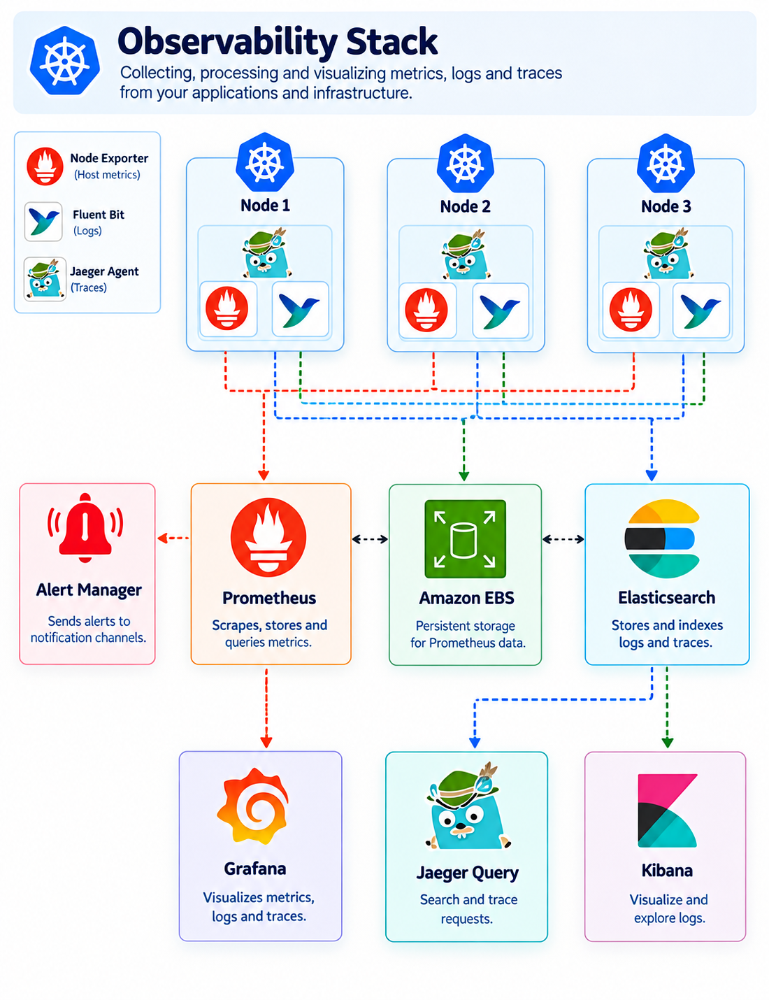

## Instrumentation and Custom Metrics

> **File:** `README.md`

A practical observability lab for learning **application instrumentation, Prometheus custom metrics, Kubernetes ServiceMonitor, Alertmanager, application logging, and distributed tracing with OpenTelemetry**.

The lab uses two small Node.js services:

* **Service A** — exposes application metrics and calls Service B.
* **Service B** — acts as a downstream service and participates in distributed tracing.

The application is containerized with Docker and deployed to Kubernetes.

## Table of Contents

* [1. Learning Objectives](#1-learning-objectives)
* [2. Architecture](#2-architecture)
* [3. What Is Instrumentation?](#3-what-is-instrumentation)
* [4. Why Application Instrumentation Is Required](#4-why-application-instrumentation-is-required)
* [5. Exporters vs Custom Metrics](#5-exporters-vs-custom-metrics)
* [6. Prometheus Metric Types](#6-prometheus-metric-types)
  * [6.1 Counter](#61-counter)
  * [6.2 Gauge](#62-gauge)
  * [6.3 Histogram](#63-histogram)
  * [6.4 Summary](#64-summary)
  * [Important distinction](#important-distinction)
* [7. Project Components](#7-project-components)
  * [Service A](#service-a)
* [8. Service B](#8-service-b)
* [9. Application Instrumentation Flow](#9-application-instrumentation-flow)
* [10. Prometheus Metrics Flow](#10-prometheus-metrics-flow)
* [11. Distributed Tracing Flow](#11-distributed-tracing-flow)
* [12. Why OTLP Is Used](#12-why-otlp-is-used)
* [13. Logging](#13-logging)
* [14. Prerequisites](#14-prerequisites)
* [15. Recommended Runtime](#15-recommended-runtime)
* [16. Create the Application](#16-create-the-application)
* [17. Build Service A](#17-build-service-a)
* [18. Build Service B](#18-build-service-b)
* [19. Test the Images Locally](#19-test-the-images-locally)
* [20. Push Images to Docker Hub](#20-push-images-to-docker-hub)
* [21. Deploy to Kubernetes](#21-deploy-to-kubernetes)
* [22. Configure Observability Resources](#22-configure-observability-resources)
* [23. Verify Metrics](#23-verify-metrics)
* [24. Generate Traffic](#24-generate-traffic)
* [25. Test Distributed Tracing](#25-test-distributed-tracing)
* [26. Test Alerting](#26-test-alerting)
* [27. Cleanup](#27-cleanup)
* [28. Troubleshooting](#28-troubleshooting)
  * [Pod Is Not Starting](#pod-is-not-starting)
  * [ImagePullBackOff](#imagepullbackoff)
  * [`/metrics` Is Not Available](#metrics-is-not-available)
  * [Prometheus Does Not Show the Metrics](#prometheus-does-not-show-the-metrics)
  * [Service A Cannot Reach Service B](#service-a-cannot-reach-service-b)
  * [Traces Are Missing](#traces-are-missing)
* [29. Interview Questions](#29-interview-questions)
* [30. Git Workflow](#30-git-workflow)
* [31. Final Architecture](#31-final-architecture)
* [32. Important Ownership and Repository Rules](#32-important-ownership-and-repository-rules)
* [33. What We Built](#33-what-we-built)

## 1. Learning Objectives

By completing this section, we learn how to:

1. Understand application instrumentation.
2. Understand exporters versus application-level custom metrics.
3. Understand Prometheus metric types:
   * Counter
   * Gauge
   * Histogram
   * Summary
4. Instrument a Node.js application using `prom-client`.
5. Expose metrics through `/metrics`.
6. Build our own Docker images.
7. Push versioned images to Docker Hub.
8. Deploy multiple services to Kubernetes.
9. Configure Prometheus scraping with `ServiceMonitor`.
10. Create Prometheus alerting rules.
11. Configure Alertmanager notifications.
12. Generate application logs.
13. Understand how application logs can be collected by an EFK stack.
14. Instrument Node.js services for distributed tracing with OpenTelemetry.
15. Export traces using OTLP.
16. Follow a request from Service A to Service B.
17. Generate traffic and inspect custom metrics.
18. Test application failure and pod-restart alerts.
19. Troubleshoot common observability problems.
20. Clean up all resources after the lab.

## 2. Architecture



A simplified architecture is:

```text
                         External Client
                               |
                               |
                               v
                    +----------------------+
                    |  Kubernetes Service  |
                    |      service-a       |
                    |    LoadBalancer      |
                    +----------+-----------+
                               |
                               v
                    +----------------------+
                    |      Service A       |
                    |    Node.js/Express   |
                    |       Port 3001      |
                    +----+------------+----+
                         |            |
              HTTP call  |            | /metrics
                         |            |
                         v            v
            +----------------+  +-----------------+
            |   Service B    |  |   Prometheus    |
            | Node.js/Express|  |    scraping     |
            |   Port 3002    |  +--------+--------+
            +-------+--------+           |
                    |                    |
                    | traces             | alerts
                    v                    v
            +---------------+   +----------------+
            | OpenTelemetry |   | Alertmanager   |
            | / OTLP        |   +--------+-------+
            +-------+-------+            |
                    |                    |
                    v                    v
            +-------------+         Email/SMTP
            |   Jaeger    |
            |  Trace UI   |
            +-------------+

Kubernetes application logs
        |
        v
   Fluent Bit
        |
        v
  Elasticsearch
        |
        v
     Kibana
```

## 3. What Is Instrumentation?

Instrumentation means adding the ability to observe an application.

Without instrumentation, an application may simply perform work:

```text
Client
   |
   v
Application
   |
   v
Response
```

We know that a response was returned, but we may not know:

* how many requests arrived;
* how long requests took;
* how many requests failed;
* how many users are active;
* how many times an operation occurred;
* which downstream service was slow;
* where an error occurred in a distributed request.

Instrumentation adds this visibility.

```text
Application
    |
    +---- Metrics
    |
    +---- Logs
    |
    +---- Traces
```

These three telemetry signals answer different questions.

| Signal  | Main question                     |
| ------- | --------------------------------- |
| Metrics | What is happening?                |
| Logs    | What happened?                    |
| Traces  | Where did the request spend time? |

## 4. Why Application Instrumentation Is Required

Infrastructure monitoring can tell us that a Kubernetes node is healthy.

For example:

```text
CPU:       35%
Memory:    62%
Disk:      48%
Network:   Normal
```

But that does not necessarily tell us whether the application is healthy.

An application could have:

```text
HTTP 500 errors: 18%
Average latency: 4.2 seconds
Successful requests: 82%
```

while the node itself is completely healthy.

Application instrumentation provides visibility inside the application.

## 5. Exporters vs Custom Metrics

An exporter generally exposes metrics from another system in a format Prometheus can scrape.

Examples include:

* Node Exporter — operating-system and host metrics.
* MySQL Exporter — MySQL metrics.
* PostgreSQL Exporter — PostgreSQL metrics.

Application instrumentation is different.

We add instrumentation directly into the application.

For example:

```javascript
httpRequestCounter.inc();
```

This records an HTTP request.

The application itself becomes the source of the metric.

## 6. Prometheus Metric Types

### 6.1 Counter

A Counter represents a cumulative value that normally only increases.

Examples:

```text
HTTP requests
HTTP errors
Processed jobs
Completed transactions
```

Example:

```javascript
const httpRequestCounter = new promClient.Counter({
  name: 'http_requests_total',
  help: 'Total number of HTTP requests received',
});
```

Every request increments the Counter:

```javascript
httpRequestCounter.inc();
```

Prometheus can then calculate rates such as:

```promql
rate(http_requests_total[5m])
```

### 6.2 Gauge

A Gauge represents a value that can increase or decrease.

Examples:

```text
Current active users
Current queue size
Memory usage
Temperature
```

Example:

```javascript
const activeRequestsGauge = new promClient.Gauge({
  name: 'active_requests',
  help: 'Number of HTTP requests currently being processed',
});
```

A Gauge can move in both directions.

```text
10
 |
 | +5
 v
15
 |
 | -7
 v
8
```

### 6.3 Histogram

A Histogram records observations and places them into configurable buckets.

It is useful for values such as:

* request duration;
* response size;
* processing time.

Example:

```javascript
const requestDurationHistogram = new promClient.Histogram({
  name: 'http_request_duration_seconds',
  help: 'HTTP request duration in seconds',
  labelNames: ['method', 'route', 'status_code'],
  buckets: [0.1, 0.5, 1, 2, 5],
});
```

The buckets answer questions such as:

> How many requests completed within 500 milliseconds?

Histogram metrics are particularly useful when calculating latency distributions and percentile approximations.

### 6.4 Summary

A Summary records observations and exposes count, sum, and configured quantiles.

Example:

```javascript
const requestDurationSummary = new promClient.Summary({
  name: 'http_request_duration_summary_seconds',
  help: 'HTTP request duration summary in seconds',
  labelNames: ['method', 'route', 'status_code'],
  percentiles: [0.5, 0.9, 0.95, 0.99],
});
```

#### Important distinction

A Summary calculates configured quantiles on the client side.

A Histogram records bucket counts, which Prometheus can use to calculate quantiles across multiple application instances.

For horizontally scaled applications, Histograms are generally more useful when we need aggregatable latency percentiles.

## 7. Project Components

### Service A

Service A:

* listens on port `3001`;
* exposes custom Prometheus metrics;
* generates logs;
* calls Service B;
* participates in distributed tracing;
* provides endpoints for testing success and failure.

Important endpoints:

| Endpoint          | Purpose                             |
| ----------------- | ----------------------------------- |
| `/`               | Basic response                      |
| `/healthy`        | Health check                        |
| `/serverError`    | Generate HTTP 500                   |
| `/notFound`       | Generate HTTP 404                   |
| `/logs`           | Generate application logs           |
| `/crash`          | Intentionally terminate the process |
| `/example`        | Generate a measured operation       |
| `/metrics`        | Expose Prometheus metrics           |
| `/call-service-b` | Call Service B                      |

## 8. Service B

Service B:

* listens on port `3002`;
* provides `/hello`;
* acts as a downstream service;
* participates in distributed tracing.

Service B does not need to expose the same custom metrics as Service A for this lab.

## 9. Application Instrumentation Flow

```text
HTTP Request
     |
     v
Express middleware
     |
     +---- Counter increment
     |
     +---- Start timing
     |
     +---- Active request Gauge
     |
     v
Application endpoint
     |
     +---- response
     |
     +---- Histogram observation
     |
     +---- Summary observation
     |
     +---- Gauge decrement
```

## 10. Prometheus Metrics Flow

```text
Service A
    |
    | GET /metrics
    v
ServiceMonitor
    |
    v
Prometheus
    |
    v
PromQL
```

The application must first expose metrics.

Prometheus then needs a scrape configuration.

In this Kubernetes lab, the `ServiceMonitor` provides that discovery configuration.

## 11. Distributed Tracing Flow

A request can travel through multiple services:

```text
Client
  |
  v
Service A
  |
  | HTTP request
  v
Service B
```

A distributed trace connects those operations into a single trace.

```text
Trace
 |
 +-- Service A span
       |
       +-- HTTP client span
              |
              +-- Service B span
```

OpenTelemetry instrumentation propagates trace context between services.

The W3C Trace Context mechanism uses headers such as:

```text
traceparent
```

This allows Service B to continue the trace started by Service A.

## 12. Why OTLP Is Used

The older implementation used the direct Jaeger exporter.

For this updated project, we use OpenTelemetry's OTLP exporter.

OTLP is the standard OpenTelemetry protocol and allows telemetry to be sent to an OpenTelemetry Collector or directly to compatible backends such as Jaeger.

This gives us a cleaner architecture:

```text
Node.js
   |
   | OTLP
   v
OpenTelemetry Collector / Jaeger
   |
   v
Trace backend
```

The application is therefore less tightly coupled to one tracing backend.

## 13. Logging

The application generates logs using:

* Morgan for HTTP access logging.
* Pino for application logging.

The application logs can be collected by a Kubernetes logging pipeline such as:

```text
Application
    |
    v
stdout/stderr
    |
    v
Fluent Bit
    |
    v
Elasticsearch
    |
    v
Kibana
```

This section focuses on application instrumentation and custom metrics. The EFK components themselves are not redeployed by the manifests in this directory.

## 14. Prerequisites

We need:

* Docker
* Docker Hub account
* Kubernetes cluster
* `kubectl`
* Kustomize support through `kubectl`
* Prometheus Operator / kube-prometheus-stack
* Alertmanager
* Jaeger or OpenTelemetry-compatible tracing backend
* Bash shell for `test.sh`

Verify:

```bash
docker --version
kubectl version --client
kubectl kustomize --help
```

Check the cluster:

```bash
kubectl get nodes
```

## 15. Recommended Runtime

The original application used Node.js 18.

Node.js 18 is now EOL, so it should not be used for the updated project. Node.js 24 is currently an LTS release, while Node.js 26 is the Current release line.

The Dockerfiles therefore use:

```text
node:24-alpine
```

We intentionally use an LTS line for the lab rather than the Current line.

## 16. Create the Application

The complete application files are provided in:

```text
application/service-a/
application/service-b/
```

After creating them, install dependencies locally.

For Service A:

```bash
cd application/service-a
npm install
```

For Service B:

```bash
cd application/service-b
npm install
```

This creates:

```text
package-lock.json
```

The lock file should be committed to Git, but it should be generated by npm rather than manually written.

## 17. Build Service A

From the Service A directory:

```bash
docker build \
  -t sachinrajguru/instrumentation-service-a:1.0.0 \
  .
```

Verify:

```bash
docker images | grep instrumentation-service-a
```

## 18. Build Service B

```bash
docker build \
  -t sachinrajguru/instrumentation-service-b:1.0.0 \
  .
```

Verify:

```bash
docker images | grep instrumentation-service-b
```

## 19. Test the Images Locally

Service B:

```bash
docker run --rm \
  --name instrumentation-service-b \
  -p 3002:3002 \
  sachinrajguru/instrumentation-service-b:1.0.0
```

Test:

```bash
curl http://localhost:3002/hello
```

Expected:

```text
Hello from Service B!
```

## 20. Push Images to Docker Hub

Login:

```bash
docker login
```

Push Service A:

```bash
docker push \
  sachinrajguru/instrumentation-service-a:1.0.0
```

Push Service B:

```bash
docker push \
  sachinrajguru/instrumentation-service-b:1.0.0
```

Verify:

```bash
docker image inspect \
  sachinrajguru/instrumentation-service-a:1.0.0
```

## 21. Deploy to Kubernetes

First create the namespace:

```bash
kubectl create namespace dev
```

Then:

```bash
kubectl apply -k kubernetes-manifest/
```

Check:

```bash
kubectl get pods -n dev
```

```bash
kubectl get svc -n dev
```

## 22. Configure Observability Resources

Apply:

```bash
kubectl apply -k alerts-alertmanager-servicemonitor-manifest/
```

Check:

```bash
kubectl get servicemonitor -n monitoring
```

Check rules:

```bash
kubectl get prometheusrule -n monitoring
```

Check Alertmanager configuration:

```bash
kubectl get alertmanagerconfig -n monitoring
```

## 23. Verify Metrics

Find the Service A LoadBalancer address:

```bash
kubectl get svc a-service -n dev
```

Test:

```bash
curl http://<LOAD_BALANCER_ADDRESS>/
```

Metrics:

```bash
curl http://<LOAD_BALANCER_ADDRESS>/metrics
```

We should see metrics such as:

```text
http_requests_total
http_request_duration_seconds
http_request_duration_summary_seconds
active_requests
```

## 24. Generate Traffic

Run:

```bash
./test.sh <LOAD_BALANCER_ADDRESS>
```

The script sends repeated requests to multiple endpoints.

This creates:

* successful requests;
* errors;
* metric observations;
* logs;
* Service A → Service B calls.

## 25. Test Distributed Tracing

Open:

```text
/call-service-b
```

For example:

```bash
curl http://<LOAD_BALANCER_ADDRESS>/call-service-b
```

The request path becomes:

```text
Client
  |
  v
Service A
  |
  | HTTP
  v
Service B
```

Open the Jaeger UI and search for the Service A service name.

The trace should contain spans representing the request flow.

## 26. Test Alerting

The project includes a pod-restart alert.

The test endpoint:

```text
/crash
```

intentionally terminates the Service A process.

Call it multiple times:

```bash
curl http://<LOAD_BALANCER_ADDRESS>/crash
```

Kubernetes should restart the container.

Check:

```bash
kubectl get pods -n dev
```

Check restart count:

```bash
kubectl get pods -n dev
```

Describe:

```bash
kubectl describe pod <POD_NAME> -n dev
```

## 27. Cleanup

Delete the Kubernetes application:

```bash
kubectl delete -k kubernetes-manifest/
```

Delete observability configuration:

```bash
kubectl delete -k alerts-alertmanager-servicemonitor-manifest/
```

Delete the namespace:

```bash
kubectl delete namespace dev
```

Remove local images if required:

```bash
docker rmi \
  sachinrajguru/instrumentation-service-a:1.0.0

docker rmi \
  sachinrajguru/instrumentation-service-b:1.0.0
```

## 28. Troubleshooting

### Pod is not starting

```bash
kubectl get pods -n dev
```

```bash
kubectl describe pod <POD_NAME> -n dev
```

Check logs:

```bash
kubectl logs <POD_NAME> -n dev
```

### ImagePullBackOff

Check:

```bash
kubectl describe pod <POD_NAME> -n dev
```

Verify that the image exists:

```bash
docker pull sachinrajguru/instrumentation-service-a:1.0.0
```

If Docker Hub is private, configure an image pull secret.

### `/metrics` is not available

Check:

```bash
kubectl logs <POD_NAME> -n dev
```

Test the endpoint from inside the pod:

```bash
kubectl exec -it <POD_NAME> -n dev -- \
  wget -qO- http://localhost:3001/metrics
```

### Prometheus does not show the metrics

Check ServiceMonitor:

```bash
kubectl get servicemonitor -n monitoring
```

Check its YAML:

```bash
kubectl get servicemonitor \
  a-service-service-monitor \
  -n monitoring \
  -o yaml
```

Verify:

* namespace;
* selector;
* service labels;
* endpoint port;
* Prometheus Operator configuration.

### Service A cannot reach Service B

Check:

```bash
kubectl get svc -n dev
```

Expected:

```text
a-service
b-service
```

From Service A:

```bash
kubectl exec -it <SERVICE_A_POD> -n dev -- \
  wget -qO- http://b-service.dev/hello
```

### Traces are missing

Check:

```bash
kubectl logs <SERVICE_A_POD> -n dev
```

and:

```bash
kubectl logs <SERVICE_B_POD> -n dev
```

Verify the OTLP endpoint:

```bash
kubectl get deployment service-a-deployment -n dev -o yaml
```

The tracing endpoint must be reachable from the application pods.

## 29. Interview Questions

### What is instrumentation?

Instrumentation is the process of adding telemetry collection capabilities to an application so that we can observe metrics, logs, and traces.

### What is a custom metric?

A custom metric is an application-specific metric created to measure business or application behavior.

Examples:

```text
HTTP request count
Order processing count
Active users
Request latency
```

### Counter vs Gauge?

A Counter normally only increases.

A Gauge can increase and decrease.

Example:

```text
Counter → total HTTP requests
Gauge   → active requests
```

### Histogram vs Summary?

A Histogram records observations into buckets.

A Summary records count, sum, and configured quantiles.

Histograms are generally preferable when we need to aggregate latency distributions across multiple instances.

### Why do we expose `/metrics`?

Prometheus needs an endpoint from which it can scrape metrics.

The `/metrics` endpoint exposes the application's metrics in Prometheus exposition format.

### What is a ServiceMonitor?

A ServiceMonitor is a Prometheus Operator custom resource used to describe how Prometheus should discover and scrape Kubernetes services.

### Why use Docker?

Docker packages the application and its runtime dependencies into a container image.

This makes the application easier to run consistently across environments.

### Why use `npm ci` instead of `npm install` in the Docker build?

`npm ci` is intended for clean, reproducible installations using the committed lock file.

It helps ensure that the container gets the dependency versions recorded in `package-lock.json`.

### Why use an LTS Node.js image?

LTS releases receive longer-term maintenance and are generally preferable for stable application environments.

Node.js 24 is an LTS line as of September 2026.

### What is distributed tracing?

Distributed tracing follows a request as it travels through multiple services.

Example:

```text
Client
  |
  v
Service A
  |
  v
Service B
```

A trace connects these operations so we can understand the complete request path.

### Why use OpenTelemetry?

OpenTelemetry provides vendor-neutral APIs, SDKs, instrumentation and telemetry protocols.

It allows the application to generate telemetry without tightly coupling the instrumentation code to a particular backend.

### Why use OTLP instead of the old direct Jaeger exporter?

OTLP is the OpenTelemetry-native telemetry protocol and is supported by Jaeger. OpenTelemetry's current guidance recommends OTLP and documents sending telemetry through the OpenTelemetry Collector or directly to compatible backends.

## 30. Git Workflow

After creating the files:

```bash
git status
```

Add:

```bash
git add instrumentation-and-custom-metrics/
```

Commit:

```bash
git commit -m "docs(observability): add instrumentation and custom metrics lab"
```

After application implementation:

```bash
git add instrumentation-and-custom-metrics/application/
```

```bash
git commit -m "feat(observability): add instrumented node services"
```

After Kubernetes manifests:

```bash
git add instrumentation-and-custom-metrics/kubernetes-manifest/
```

```bash
git commit -m "feat(observability): add kubernetes service deployments"
```

After alerting configuration:

```bash
git add instrumentation-and-custom-metrics/alerts-alertmanager-servicemonitor-manifest/
```

```bash
git commit -m "feat(observability): add prometheus alerting and servicemonitor"
```

## 31. Final Architecture

At the end of the lab:

```text
                         ┌──────────────────┐
                         │      Client      │
                         └────────┬─────────┘
                                  │
                                  ▼
                       ┌──────────────────────┐
                       │ Kubernetes Service A │
                       │    LoadBalancer      │
                       └──────────┬───────────┘
                                  │
                                  ▼
                       ┌──────────────────────┐
                       │      Service A       │
                       │       Node.js        │
                       │                      │
                       │ Metrics              │
                       │ Logs                 │
                       │ Traces               │
                       └──────┬─────────┬─────┘
                              │         │
                       HTTP   │         │ /metrics
                              │         │
                              ▼         ▼
                       ┌──────────┐  ┌────────────┐
                       │Service B │  │ Prometheus │
                       │ Node.js  │  └──────┬─────┘
                       └────┬─────┘         │
                            │               │
                            │ OTLP          │ Alert
                            │               ▼
                            │        ┌──────────────┐
                            └───────►│ Alertmanager │
                                     └──────┬───────┘
                                            │
                                            ▼
                                          Email

             Application traces
                      │
                      ▼
                    OTLP
                      │
                      ▼
                   Jaeger

             Application logs
                      │
                      ▼
                 Fluent Bit
                      │
                      ▼
                Elasticsearch
                      │
                      ▼
                   Kibana
```

## 32. Important Ownership and Repository Rules

This project intentionally uses **our own application and container images**.

There are no references to another instructor, channel, or Docker Hub account.

The images are:

```text
sachinrajguru/instrumentation-service-a:1.0.0
sachinrajguru/instrumentation-service-b:1.0.0
```

The Kubernetes manifests must always use the matching service image.

Service A:

```text
instrumentation-service-a
```

Service B:

```text
instrumentation-service-b
```

Do not use:

```text
demoservice-a
demoservice-b
```

or another person's Docker Hub namespace.

## 33. What We Built

We started with two simple Node.js services and progressively added observability:

```text
Node.js Application
       │
       ├── Metrics
       │     ├── Counter
       │     ├── Gauge
       │     ├── Histogram
       │     └── Summary
       │
       ├── Logs
       │
       └── Distributed Tracing
             │
             └── OpenTelemetry + OTLP
                    │
                    ▼
                   Jaeger

Metrics
   │
   ▼
Prometheus
   │
   ▼
ServiceMonitor
   │
   ▼
Alerting Rules
   │
   ▼
Alertmanager
   │
   ▼
Notification
```

This gives us a complete foundation for understanding **application observability in a Kubernetes environment**.
