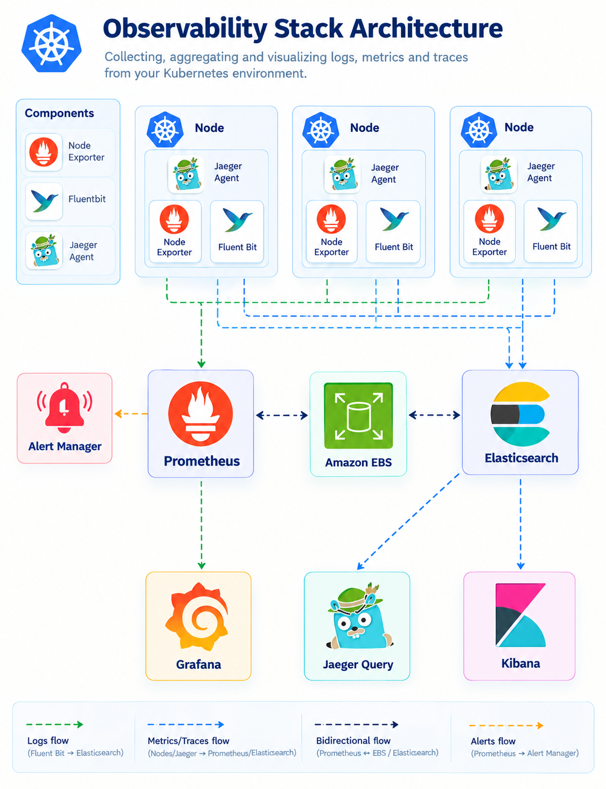

## Distributed Tracing with Jaeger

> **File:** `README.md`

This topic introduces distributed tracing as the third pillar of observability and demonstrates how to collect, store, and analyze traces from the microservices application created in the previous observability topics.

We use:

- Amazon EKS
- Kubernetes
- OpenTelemetry
- Jaeger
- Elasticsearch
- Helm
- Node.js
- Service A and Service B from Topic 04

## Table of Contents

- [Overview](#overview)
- [What We Will Build](#what-we-will-build)
- [Architecture](#architecture)
- [Project Structure](#project-structure)
- [Prerequisites](#prerequisites)
- [Related Topics](#related-topics)
- [Implementation Guide](#implementation-guide)
- [Core Concepts](#core-concepts)
- [Expected Outcome](#expected-outcome)
- [Cleanup](#cleanup)

## Overview

Distributed tracing helps us understand the complete path of a request as it travels through multiple services.

For example:

```text
Client
  |
  v
Service A
  |
  v
Service B
  |
  v
External Service / Database
````

A single user request can cross multiple services, network boundaries, proxies, and external dependencies.

Metrics can tell us that latency increased.

Logs can provide detailed events from individual services.

Tracing connects these operations together into a single request flow.

A trace is composed of multiple spans. Each span represents an individual operation and records information such as:

* Start time
* Duration
* Service
* Operation
* Status
* Attributes
* Parent-child relationships

## What We Will Build

In this topic, we will:

1. Understand distributed tracing.
2. Understand traces and spans.
3. Understand OpenTelemetry instrumentation.
4. Understand Jaeger.
5. Reuse the OpenTelemetry instrumentation from Topic 04.
6. Reuse Elasticsearch from Topic 05.
7. Deploy Jaeger using Helm.
8. Configure Jaeger to use Elasticsearch as persistent trace storage.
9. Configure secure communication between Jaeger and Elasticsearch.
10. Configure Service A and Service B to export traces to Jaeger.
11. Generate application traffic.
12. Explore traces in the Jaeger UI.
13. Analyze a Service A to Service B request.
14. Troubleshoot common tracing problems.
15. Clean up the Jaeger resources.

## Architecture



The complete observability flow is:

```text
                         Kubernetes Cluster
                                |
             +------------------+------------------+
             |                  |                  |
             v                  v                  v
        Service A          Service B        Observability
        Metrics             Traces             Stack
             |                  |                  |
             v                  v                  v
        Prometheus         OpenTelemetry        Jaeger
             |                  |                  |
             v                  v                  v
          Grafana            Jaeger          Elasticsearch
                                |                  |
                                +------------------+
                                         |
                                         v
                                  Jaeger UI / Kibana
```

The distributed tracing flow is:

```text
Service A
   |
   | OTLP/HTTP
   v
Jaeger
   |
   | HTTPS
   v
Elasticsearch
   |
   | Query
   v
Jaeger UI
```

When Service A calls Service B, OpenTelemetry propagates the trace context between the services:

```text
Trace
 |
 +-- instrumentation-service-a
 |      |
 |      +-- /call-service-b
 |
 +-- instrumentation-service-b
        |
        +-- /hello
```

## Project Structure

```text
06-distributed-tracing-with-Jaeger/
├── README.md
├── 01-distributed-tracing-with-Jaeger.md
│
├── helm-values/
│   └── jaeger-values.yaml
│
└── images/
    └── architecture.png
```

## Prerequisites

Before starting this topic, we should have:

* An Amazon EKS cluster
* `kubectl` configured for the cluster
* Helm installed
* Topic 04 application deployed
* Service A deployed in the `dev` namespace
* Service B deployed in the `dev` namespace
* OpenTelemetry instrumentation available in Service A and Service B
* Elasticsearch deployed from Topic 05
* Elasticsearch available in the `logging` namespace

Verify the Kubernetes cluster:

```bash
kubectl get nodes
```

Verify the application:

```bash
kubectl get pods -n dev
kubectl get svc -n dev
```

Verify Elasticsearch:

```bash
kubectl get pods -n logging
kubectl get svc -n logging
```

## Related Topics

This topic is intentionally connected to the previous observability topics.

### Topic 04 - Instrumentation and Custom Metrics

Topic 04 created the Node.js services used throughout this observability project.

The applications include:

* Service A
* Service B

The applications already contain OpenTelemetry tracing instrumentation.

Service A can call Service B through:

```text
/call-service-b
```

This gives us a real distributed request to trace.

### Topic 05 - Logging with EFK

Topic 05 introduced centralized logging using:

* Fluent Bit
* Elasticsearch
* Kibana

The Elasticsearch deployment from Topic 05 is reused as the trace storage backend for this topic.

### Topic 06 - Distributed Tracing with Jaeger

This topic adds Jaeger and connects the existing OpenTelemetry-instrumented applications to it.

The resulting observability stack contains:

```text
Metrics  -> Prometheus -> Grafana
Logs     -> Fluent Bit -> Elasticsearch -> Kibana
Traces   -> OpenTelemetry -> Jaeger -> Elasticsearch -> Jaeger UI
```

## Implementation Guide

The complete implementation is documented in:

`01-distributed-tracing-with-Jaeger.md`

The guide covers:

* Distributed tracing concepts
* Traces and spans
* OpenTelemetry
* Jaeger architecture
* Elasticsearch integration
* TLS configuration
* Jaeger Helm installation
* Application configuration
* Trace generation
* Jaeger UI
* Service A to Service B tracing
* Troubleshooting
* Validation
* Cleanup

## Core Concepts

### Trace

A trace represents the complete journey of a request through a distributed system.

### Span

A span represents one operation within a trace.

Example:

```text
Trace
 |
 +-- Service A request
 |
 +-- Service A downstream call
 |
 +-- Service B request
 |
 +-- Service B /hello
```

### Context Propagation

Context propagation allows Service A to pass tracing information to Service B.

This allows both services to appear as part of the same distributed trace.

### OpenTelemetry

OpenTelemetry provides the application instrumentation, trace context propagation, and OTLP telemetry protocol.

### Jaeger

Jaeger receives, processes, stores, and visualizes distributed traces.

## Expected Outcome

After completing this topic, we should be able to:

* Open the Jaeger UI.
* See Service A and Service B.
* Search for traces.
* View individual traces.
* Inspect individual spans.
* Understand parent-child span relationships.
* Identify the time spent in each operation.
* Follow a request from Service A to Service B.
* Use tracing information to investigate latency.

The primary demonstration is:

```text
Client
  |
  v
Service A
  |
  | /call-service-b
  v
Service B
  |
  | /hello
  v
Response
```

Jaeger should allow us to inspect this request as a distributed trace.

## Cleanup

The detailed cleanup procedure is available in:

[01-distributed-tracing-with-Jaeger.md](01-distributed-tracing-with-Jaeger.md)

The normal Topic 06 cleanup removes Jaeger and the Topic 06-specific Kubernetes resources.

It does not remove the shared Elasticsearch deployment from Topic 05 or the EKS cluster.
